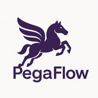

# Pegaflow

<div align="center">
  
  <p><strong><em>KV cache on the wings of Pegasus.</em></strong></p>

  [](https://github.com/novitalabs/pegaflow/actions/workflows/ci.yml)
  [](https://pypi.org/project/pegaflow-llm/)
  [](LICENSE)
</div>

**PegaFlow is a high-performance KV cache storage engine for LLM inference.** Offload KV cache from GPU to host memory or SSD, and share it across nodes via RDMA.

- **Decoupled from inference lifecycle** — runs as an independent sidecar; KV cache survives engine restarts, scales independently, and is shared across instances
- **Topology-aware, PCIe-saturating transfers** — NUMA-aware pinned memory + layer-wise DMA to maximize hardware bandwidth
- **GIL-free Rust core** — zero Python overhead on the hot path; your inference engine keeps its threads
- **Production-ready observability** — built-in Prometheus metrics and OTLP export, not an afterthought
- **Pluggable** — works with vLLM and SGLang as a drop-in KV connector

## Framework Integration

| Framework | Status | Link |
|-----------|--------|------|
| vLLM | ✅ Ready | [Quick Start](#3-launch-your-inference-engine) |
| SGLang | 🚧 Under Review | [PR #17221](https://github.com/sgl-project/sglang/pull/17221) |

## Quick Start

### 1. Install

```bash
uv pip install pegaflow-llm        # CUDA 12
uv pip install pegaflow-llm-cu13   # CUDA 13
```

### 2. Start PegaFlow Server

```bash
pegaflow-server
```

### 3. Launch your inference engine

**vLLM (recommended):**

```bash
vllm serve Qwen/Qwen3-0.6B \
  --kv-transfer-config '{"kv_connector": "PegaKVConnector", "kv_role": "kv_both", "kv_connector_module_path": "pegaflow.connector"}'
```

**SGLang:**

```bash
python3 -m sglang.launch_server \
  --model-path Qwen/Qwen3-0.6B \
  --enable-pegaflow
```

> For full server options, multi-node setup, and advanced configuration, see [Server Configuration](./docs/server.md).

## Development

### Build from source

```bash
export PYO3_PYTHON=$(which python)
export LD_LIBRARY_PATH=$(python -c "import sysconfig; print(sysconfig.get_config_var('LIBDIR'))"):$LD_LIBRARY_PATH

cargo run -r                    # start server
cd python && maturin develop -r # build Python bindings
```

We use [Conventional Commits](https://www.conventionalcommits.org/) — run `cz c` for an interactive commit prompt.

## Benchmarks

### KV Cache Benchmark

H800 reference numbers with Llama-3.1-8B (8 prompts, 10K-token prefill, 1-token decode, 4.0 req/s):

| Configuration   | TTFT mean (ms) | TTFT p99 (ms) |
| --------------- | -------------- | ------------- |
| PegaFlow (Cold) | 572.5          | 1113.7        |
| PegaFlow (Warm) | 61.5           | 77.0          |

The warm-start path achieves **~9x faster TTFT** compared to cold-start, demonstrating effective KV cache sharing across requests.

## Documentation

- [Server Configuration](./docs/server.md) — full CLI options, SSD cache, multi-node setup
- [P2P KV Cache Sharing](./docs/p2p.md) — cross-node RDMA setup, tuning, and troubleshooting
- [P/D Router](./docs/pd.md) — prefill/decode disaggregation
- [vLLM I/O Patch](./docs/vllm-patch.md) — optional patch for better transfer throughput
- [Metrics](./docs/metrics.md) — Prometheus and OTLP metrics reference
- [Goals & Non-Goals](./docs/goals.md) — project scope and design philosophy
