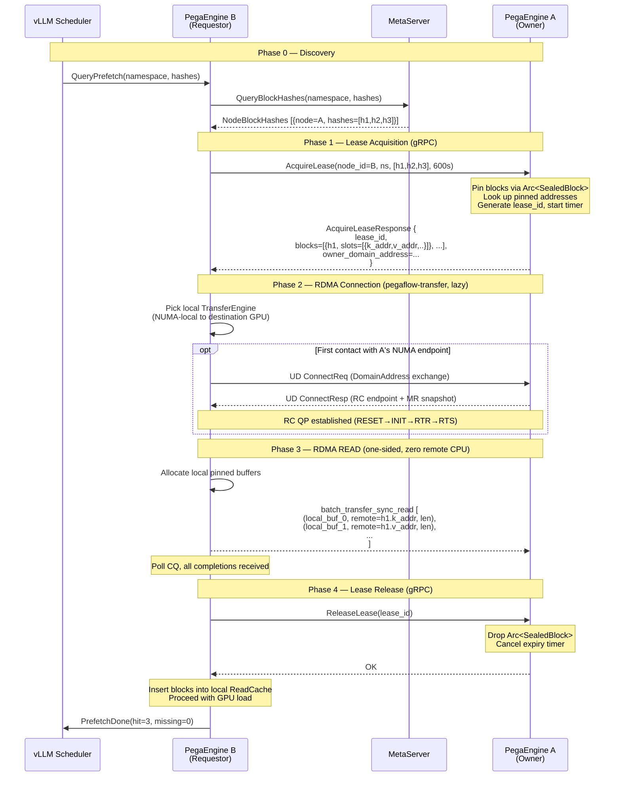
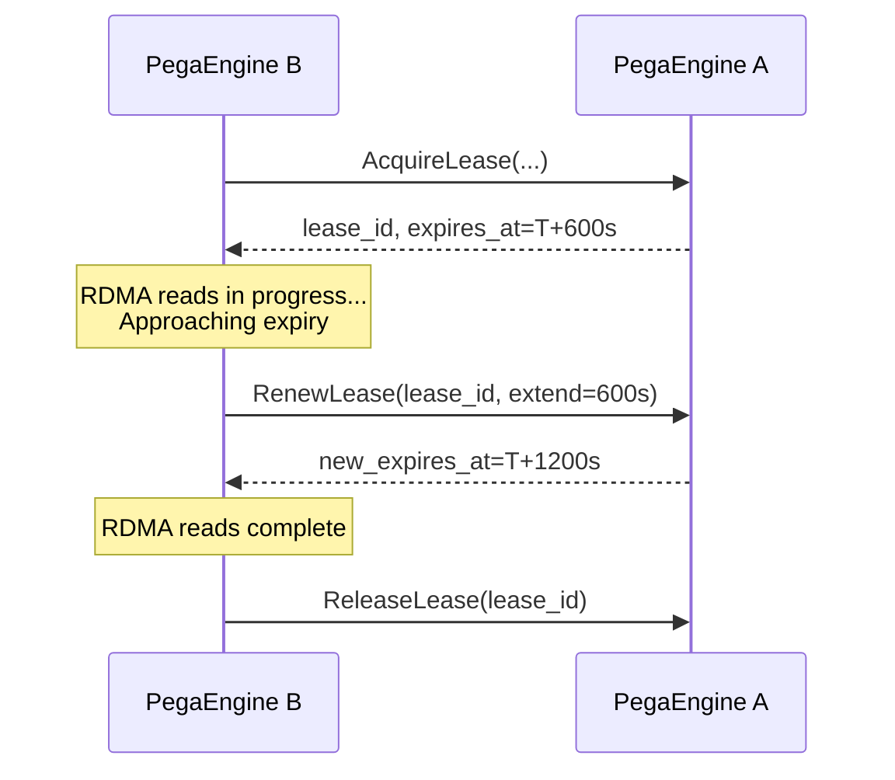
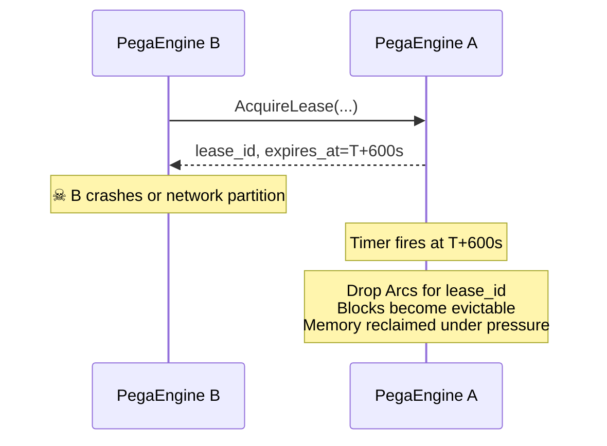
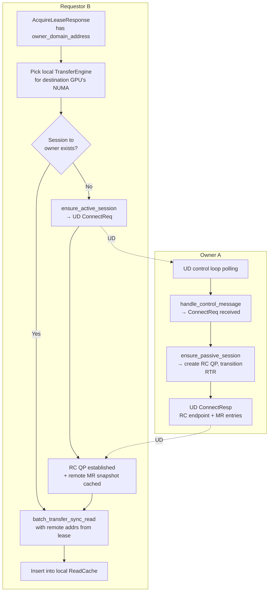
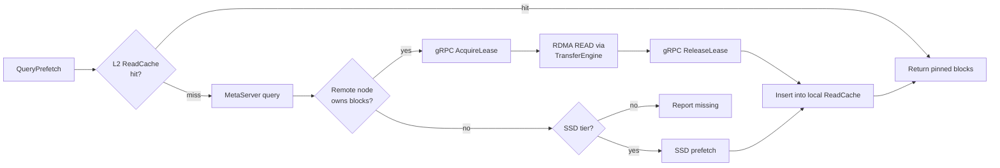

# RDMA P2P KV Cache Transfer — Design Document

## 1. Overview

Goal: Add RDMA read-based P2P KV cache transfer to PegaFlow, enabling nodes to directly read KV blocks from remote pinned memory without involving remote CPU in the data path.

**Core principle:** Lease control plane over gRPC, RDMA connection via `pegaflow-transfer` UD handshake, data plane over RDMA READ (one-sided).

### Current State

```
[MetaServer]  ← gRPC →  [PegaEngine A]
                         [PegaEngine B]  (knows A owns block X)
                              ↓
                         No data path — only hash discovery
```

### Target State

```
[MetaServer]  ← gRPC →  [PegaEngine A]  (registers block hashes)
                         [PegaEngine B]  (discovers block on A)
                              │
                    ① gRPC: AcquireLease(blocks)
                    ② A pins blocks, returns {addr, len} per block
                              │
                    ③ B→A: TransferEngine::batch_transfer_sync_read
                       (UD handshake on first contact, then RC RDMA READ)
                              │
                    ④ gRPC: ReleaseLease
```

---

## 2. Transport Layer: `pegaflow-transfer`

We already have a complete RDMA transport in `pegaflow-transfer`:

| Component | What it does |
|-----------|-------------|
| `TransferEngine` | Public facade — init, register memory, sync read/write |
| UD control plane | `ConnectReq` / `ConnectResp` handshake over Unreliable Datagram QP |
| RC data plane | Per-session Reliable Connection QP, up to 96 inflight ops, WR chaining (4 ops/chain) |
| `DomainAddress` | 26-byte endpoint ID: GID + LID + QPN + Qkey |
| Memory exchange | `ConnectResp` carries `Vec<RemoteMemoryEntry>` {base_ptr, end_ptr, rkey} |
| Session worker | Dedicated thread per RC session, NUMA-pinned CQ polling |

**We do NOT need to build any raw RDMA code.** The design focuses on:
1. Initializing `TransferEngine` per NUMA with the right NIC
2. Registering pinned pools as memory regions
3. Lease RPCs (gRPC) to coordinate pin/unpin + provide remote addresses
4. Calling `batch_transfer_sync_read()` with the addresses from the lease

---

## 3. Topology: Per-NUMA Transfer Engine

Each NUMA node has a co-located RDMA NIC. We run one `TransferEngine` per NUMA node.

```
┌─────────────────────── Node ────────────────────────┐
│  NUMA 0                       NUMA 1                │
│  ┌──────────────────┐         ┌──────────────────┐  │
│  │ GPU 0, 1         │         │ GPU 2, 3         │  │
│  │ PinnedPool 0     │         │ PinnedPool 1     │  │
│  │ mlx5_0           │         │ mlx5_2           │  │
│  │ TransferEngine 0 │         │ TransferEngine 1 │  │
│  │  └─ UD QP (ctrl) │         │  └─ UD QP (ctrl) │  │
│  │  └─ RC sessions  │         │  └─ RC sessions  │  │
│  └──────────────────┘         └──────────────────┘  │
│              PegaEngine (single process)             │
└─────────────────────────────────────────────────────┘
```

### Embedding in PegaEngine

```rust
struct PegaEngine {
    // ... existing fields ...
    rdma: Option<Arc<RdmaManager>>,  // None if RDMA disabled
}

struct RdmaManager {
    /// Per-NUMA transfer engine. Key = NumaNode.
    engines: HashMap<NumaNode, TransferEngine>,
    /// This node's stable identity for lease tracking.
    node_id: Uuid,
    /// Lease manager for incoming AcquireLease requests (owner side).
    lease_manager: Arc<LeaseManager>,
}
```

### Initialization

```rust
// For each NUMA node that has GPUs:
for numa in topology.numa_nodes_with_gpus() {
    let nic = topology.rdma_device_for_numa(numa);  // e.g. "mlx5_0"
    let port = allocate_rpc_port();                  // UD listen port

    let engine = TransferEngine::new();
    engine.initialize(&nic, port)?;

    // Register the NUMA-local pinned pool as a memory region
    let (pool_ptr, pool_len) = pinned_allocator.pool_region(numa);
    engine.register_memory(pool_ptr, pool_len)?;

    engines.insert(numa, engine);
}
```

The `DomainAddress` (UD endpoint) of each engine is advertised alongside block hashes to MetaServer, so requestors know which UD endpoint to connect to.

---

## 4. Node Identity & Lease Model

### 4.1 Node UUID

Each `PegaEngine` generates a `node_id: Uuid` (v4) on startup:
- Advertised to MetaServer alongside block hashes
- Identifies the lease holder in all gRPC interactions
- Survives reconnects within the same process lifetime

### 4.2 Lease Semantics

A **lease** is a time-bounded guarantee that specific blocks will not be evicted from pinned memory on the remote node.

| Property | Value |
|----------|-------|
| Default duration | 10 minutes |
| Granularity | Per-block (batch acquired) |
| Holder identity | `node_id` (UUID) |
| Renewal | Explicit `RenewLease` RPC |
| Expiry action | Remote unpins blocks, reclaims memory |
| Max leases per node | Configurable (backpressure via `max_leased_bytes`) |

### 4.3 Lease State Machine (Remote/Owner Side)

```
           AcquireLease
    ┌──────────────────────┐
    │                      ▼
 [absent] ──────────► [leased]
                        │    │
              expire/   │    │ RenewLease
              Release   │    │
                        ▼    │
                    [released]◄┘
```

- `leased`: blocks pinned via `Arc<SealedBlock>`, timer running
- `released`: Arcs dropped → blocks eligible for eviction, timer cancelled

---

## 5. gRPC Lease Service

New service `RdmaTransfer` on the **PegaEngine server** (not MetaServer).
This service only manages leases — RDMA connection is handled by `pegaflow-transfer` independently.

```protobuf
service RdmaTransfer {
  rpc AcquireLease(AcquireLeaseRequest) returns (AcquireLeaseResponse);
  rpc RenewLease(RenewLeaseRequest) returns (RenewLeaseResponse);
  rpc ReleaseLease(ReleaseLeaseRequest) returns (ReleaseLeaseResponse);
}

message AcquireLeaseRequest {
  string requester_node_id = 1;  // UUID of requesting node
  string namespace = 2;
  repeated bytes block_hashes = 3;
  uint32 lease_duration_secs = 4; // requested duration, server may cap
}

message RemoteBlockDescriptor {
  bytes block_hash = 1;
  // Per-slot memory locations (one per TP rank).
  // Requestor uses these as remote_addr in RDMA READ.
  repeated SlotMemory slots = 2;
}

message SlotMemory {
  uint64 k_addr = 1;   // remote virtual address of K segment
  uint64 k_size = 2;
  uint64 v_addr = 3;   // remote virtual address of V segment
  uint64 v_size = 4;
}

message AcquireLeaseResponse {
  string lease_id = 1;
  repeated RemoteBlockDescriptor blocks = 2;
  repeated bytes missing_hashes = 3;   // blocks not found or evicted
  uint64 expires_at_unix_ms = 4;
  // UD endpoint of the owner's transfer engine (for the NUMA node
  // where these blocks reside). Requestor uses this as the
  // DomainAddress target for TransferEngine session setup.
  bytes owner_domain_address = 5;      // 26-byte DomainAddress
}

message RenewLeaseRequest {
  string lease_id = 1;
  string requester_node_id = 2;
  uint32 extend_duration_secs = 3;
}

message RenewLeaseResponse {
  uint64 new_expires_at_unix_ms = 1;
}

message ReleaseLeaseRequest {
  string lease_id = 1;
  string requester_node_id = 2;
}

message ReleaseLeaseResponse {}
```

**Key points:**
- `owner_domain_address` is the 26-byte `DomainAddress` of the owner's per-NUMA `TransferEngine`. The requestor calls `engine.ensure_active_session(domain_addr)` to establish the RC QP if not already connected.
- `rkey` is **not** in the response — it's exchanged during `ConnectResp` (pegaflow-transfer handshake) as part of the remote memory snapshot. The requestor only needs `(remote_addr, size)` to issue RDMA READ.
- `SlotMemory` is per-TP-rank. A block with TP=4 has 4 slots, each with separate K/V addresses.

---

## 6. End-to-End Flow

### 6.1 Happy Path



### 6.2 Lease Renewal (Long Transfer)



### 6.3 Lease Expiry (Requestor Crashed)



### 6.4 Partial Hit

```mermaid
sequenceDiagram
    participant B as PegaEngine B
    participant A as PegaEngine A

    B->>A: AcquireLease(ns, [h1,h2,h3])
    Note over A: h1,h2 found; h3 evicted
    A-->>B: blocks=[h1,h2], missing=[h3]

    Note over B: RDMA READ h1, h2 only
    B->>A: ReleaseLease(lease_id)
    Note over B: h3 falls through to SSD tier
```

---

## 7. RDMA Connection Lifecycle

Connection management is entirely delegated to `pegaflow-transfer`. Here's how it maps:



**Key interactions with `TransferEngine`:**

| Step | API call | Notes |
|------|----------|-------|
| Init | `engine.initialize(nic_name, rpc_port)` | Per-NUMA, picks NIC co-located with NUMA node |
| Register pool | `engine.register_memory(pool_ptr, pool_len)` | Pinned pool becomes RDMA-readable by peers |
| Get local endpoint | `engine.get_session_id()` | Returns `DomainAddress` to advertise |
| Connect to peer | Implicit on first `transfer_sync_read` to new `DomainAddress` | UD handshake + RC setup |
| Read blocks | `engine.batch_transfer_sync_read(ops)` | `ops`: Vec of `(local_addr, remote_addr, len, peer_domain_addr)` |
| Teardown | `Drop` | QPs destroyed, MRs deregistered |

---

## 8. Lease Manager (Owner Side)

```rust
struct LeaseManager {
    leases: DashMap<LeaseId, LeaseEntry>,
    expiry_queue: Mutex<DelayQueue<LeaseId>>,  // tokio::time
    max_leased_bytes: u64,
    current_leased_bytes: AtomicU64,
}

struct LeaseEntry {
    lease_id: LeaseId,                         // Uuid
    requester: Uuid,                           // requester's node_id
    namespace: String,
    pinned_blocks: Vec<Arc<SealedBlock>>,       // Arc prevents eviction
    total_bytes: u64,
    created_at: Instant,
    expires_at: Instant,
    delay_key: delay_queue::Key,               // for renewal/cancellation
}
```

### AcquireLease handler (pseudo-code)

```rust
fn acquire_lease(req) -> AcquireLeaseResponse {
    let mut blocks = Vec::new();
    let mut missing = Vec::new();

    for hash in req.block_hashes {
        match read_cache.get_sealed(&req.namespace, &hash) {
            Some(sealed) => {
                // Collect remote addresses from the SealedBlock's LayerBlocks.
                // These are virtual addresses within the registered pinned pool.
                let slots = sealed.slots.iter().map(|layer_block| SlotMemory {
                    k_addr: layer_block.k_ptr.as_ptr() as u64,
                    k_size: layer_block.k_size,
                    v_addr: layer_block.v_ptr.map(|p| p.as_ptr() as u64).unwrap_or(0),
                    v_size: layer_block.v_size,
                }).collect();
                blocks.push((hash, slots, sealed));
            }
            None => missing.push(hash),
        }
    }

    // Backpressure check
    let total = blocks.iter().map(|b| b.2.footprint).sum();
    if current_leased_bytes.load() + total > max_leased_bytes {
        return Err(Status::resource_exhausted("lease budget exceeded"));
    }

    // Create lease — Arc<SealedBlock> held here prevents eviction
    let lease = LeaseEntry {
        lease_id: Uuid::new_v4(),
        pinned_blocks: blocks.iter().map(|b| Arc::clone(&b.2)).collect(),
        total_bytes: total,
        ...
    };
    leases.insert(lease.lease_id, lease);
    current_leased_bytes.fetch_add(total);

    // Pick the DomainAddress of the TransferEngine on the NUMA node
    // where the majority of blocks reside
    let numa = dominant_numa(&blocks);
    let domain_addr = engines[&numa].get_session_id();

    AcquireLeaseResponse {
        lease_id, blocks: descriptors, missing, expires_at,
        owner_domain_address: domain_addr.to_bytes(),
    }
}
```

### Expiry loop

```rust
// Spawned as a tokio task
async fn expiry_loop(lease_manager: Arc<LeaseManager>) {
    loop {
        let lease_id = lease_manager.expiry_queue.lock().next().await;
        if let Some((_, entry)) = lease_manager.leases.remove(&lease_id) {
            lease_manager.current_leased_bytes.fetch_sub(entry.total_bytes);
            // entry.pinned_blocks dropped → Arcs released → blocks evictable
            info!(lease_id = %entry.lease_id, "lease expired, blocks released");
        }
    }
}
```

---

## 9. Integration with Storage Tiers

RDMA P2P slots into L3 as highest-priority backing store:

```
StorageEngine
  ├── L1: PinnedAllocator (local pinned memory)
  ├── L2: ReadCache (sealed block cache)
  └── L3: BackingStores (priority order)
        ├── Priority 0: RdmaP2pBackingStore  ← NEW
        ├── Priority 1: P2pBackingStore (existing, gRPC metadata-only)
        └── Priority 2: SsdBackingStore
```

### Data flow



### `RdmaP2pBackingStore` implements `BackingStore`

- **`ingest_batch()`**: Same as existing P2P — registers hashes with MetaServer (fire-and-forget via insert actor)
- **`submit_prefix()`**: MetaServer query → for each owning node: `AcquireLease` → `batch_transfer_sync_read` → `ReleaseLease` → return blocks as `PrefetchResult`

---

## 10. MetaServer: Extended Advertisement

Current MetaServer `InsertBlockHashes` takes `node: String` (gRPC address). We extend to also carry the RDMA endpoint info:

```protobuf
message InsertBlockHashesRequest {
  string namespace = 1;
  repeated bytes block_hashes = 2;
  string node = 3;                       // gRPC address (existing)
  repeated bytes domain_addresses = 4;   // per-NUMA DomainAddress (new)
}
```

On `QueryBlockHashes`, the response `NodeBlockHashes` carries the same info back:

```protobuf
message NodeBlockHashes {
  string node = 1;
  repeated bytes block_hashes = 2;
  repeated bytes domain_addresses = 3;   // requestor can pre-establish sessions
}
```

This allows the requestor to **pre-establish RDMA sessions** before or in parallel with `AcquireLease`, avoiding the UD handshake latency on the critical path.

---

## 11. Error Handling & Edge Cases

| Scenario | Handling |
|----------|----------|
| Block evicted between MetaServer query and AcquireLease | `missing_hashes` in response; fall through to SSD |
| RDMA session setup fails | Fall through to SSD tier (no RDMA available) |
| Lease expires during RDMA read | Remote memory may be overwritten → requestor detects stale data via block hash verification after read; discard and retry |
| Requestor preempted by vLLM scheduler | `ReleaseLease` on preemption path |
| Memory pressure on owner | `RESOURCE_EXHAUSTED` on AcquireLease; requestor falls through to SSD |
| Network partition | Lease auto-expires on owner; requestor gRPC times out and falls through |
| Multiple requestors for same block | Multiple concurrent leases OK; `Arc<SealedBlock>` shared |
| Owner restarts | Leases are in-memory only; all leases lost; requestors timeout and rediscover via MetaServer |

---

## 12. Configuration

```toml
[rdma]
enabled = true
max_leased_bytes = "8GiB"        # per-node lease budget
default_lease_duration = "10m"
max_lease_duration = "30m"

# NIC auto-detection by default (picks NUMA-local device).
# Override for specific binding:
# [rdma.devices]
# numa_0 = "mlx5_0"
# numa_1 = "mlx5_2"
```

---

## 13. Open Questions

1. **Lease-before-read vs optimistic read:** Current design requires lease before read. Alternative: register MR at startup, let anyone read anytime, use epoch-based reclamation to prevent use-after-free. Simpler data path but harder to bound memory and debug stale reads.

2. **Hash verification after RDMA read:** Should the requestor re-hash the received data to detect stale reads (lease expired, memory reused)? Adds CPU cost but guarantees correctness. Could be configurable.

3. **Multi-NUMA block scatter:** If a block's slots span multiple NUMA nodes (TP ranks on different GPUs), the owner should return descriptors grouped by NUMA, and the requestor issues RDMA reads to the right `DomainAddress` for each group. Need to handle this in `AcquireLeaseResponse` — current `owner_domain_address` is singular. May need per-slot `domain_address` or a map.
