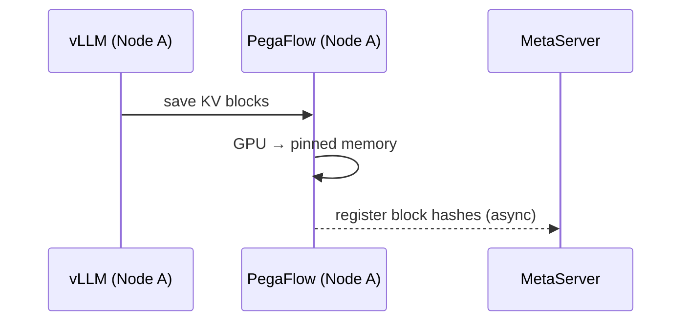
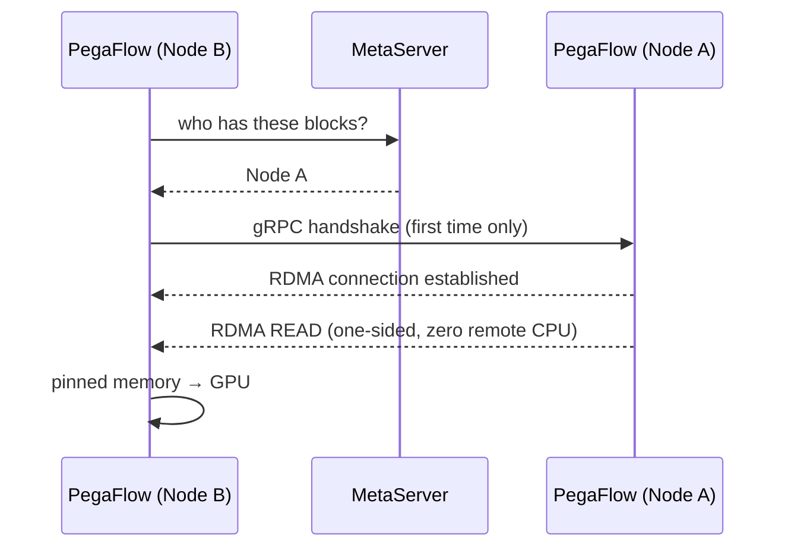

# P2P KV Cache Sharing

Share KV cache across PegaFlow nodes via RDMA. When node B needs blocks that node A already has, node B reads them directly from A's memory — one-sided RDMA READ, zero CPU involvement on the remote side.

**When to use**: multiple PegaFlow instances serving the same model, shared prefixes are common, and you want to reduce TTFT by avoiding redundant prefill.

## How It Works

### Step 1: Save & Register

Node A saves KV blocks to pinned memory. Block hashes are registered with the MetaServer in the background.



### Step 2: Discover & Fetch

Node B needs the same blocks. It queries the MetaServer, discovers Node A has them, and reads them directly via RDMA.



## Quick Start

### 1. Start MetaServer

One per cluster. Lightweight, in-memory only.

```bash
pegaflow-metaserver --addr 0.0.0.0:50056
```

### 2. Start PegaFlow nodes

Two flags enable P2P (must be set together):

- **`--nics <NAME>...`** — which RDMA NICs to use (e.g. `mlx5_0`, `mlx5_0 mlx5_1`). PegaFlow detects each NIC's NUMA node, PCIe topology, and GPU affinity automatically. All pinned memory is registered on these NICs for RDMA access.

- **`--metaserver-addr <URL>`** — the MetaServer address. Once set, this node registers its block hashes with the MetaServer and fetches remote blocks via RDMA when needed.

When P2P is enabled, `--addr` must be a routable IP (not `0.0.0.0` or `127.0.0.1`) — other nodes connect to this address for gRPC handshake and block queries.

**Node A** (e.g. `10.0.0.1`):

```bash
pegaflow-server \
  --addr 10.0.0.1:50055 \
  --pool-size 30gb \
  --nics mlx5_0 \
  --metaserver-addr http://10.0.0.100:50056
```

**Node B** (e.g. `10.0.0.2`):

```bash
pegaflow-server \
  --addr 10.0.0.2:50055 \
  --pool-size 30gb \
  --nics mlx5_0 \
  --metaserver-addr http://10.0.0.100:50056
```

### 3. Launch inference engine

Same as single-node — PegaFlow server handles P2P transparently.

```bash
vllm serve Qwen/Qwen3-0.6B \
  --kv-transfer-config '{"kv_connector": "PegaKVConnector", "kv_role": "kv_both", "kv_connector_module_path": "pegaflow.connector"}'
```

### 4. Verify

Use `--log-level debug` to confirm P2P is working. Look for MetaServer registration, RDMA handshake, and RDMA fetch messages in the logs.

## Fallback Behavior

P2P is opportunistic. Failures degrade gracefully to single-node operation — no crashes, no significant performance impact in most cases.

| Scenario | What happens |
|---|---|
| MetaServer unreachable | Hash registration silently dropped. No remote discovery attempted. |
| Remote node unreachable | gRPC handshake fails, fetch aborted. Request proceeds without remote blocks. |
| RDMA transfer timeout | Connection invalidated, transfer lock force-released. Logged as error. |

## Tuning

### Hugepages

For pools >64 GB, hugepages significantly reduce RDMA memory registration overhead and transfer latency. Configure before starting PegaFlow:

```bash
# Allocate hugepages (example: 64 GB of 2MB pages)
echo 32768 > /proc/sys/vm/nr_hugepages

pegaflow-server --pool-size 64gb --use-hugepages --nics mlx5_0 ...
```

### NUMA affinity

PegaFlow automatically detects GPU–NIC NUMA affinity at startup. For best performance, ensure GPUs and RDMA NICs share the same NUMA node. Check the topology log at startup.

### MetaServer sizing

| Cluster size | Recommendation |
|---|---|
| 2–8 nodes | Defaults are fine (`120 min` TTL) |
| 8+ nodes | Memory scales with unique blocks across all nodes; no capacity cap needed. Monitor MetaServer memory. |

### Metrics

P2P-related Prometheus metrics (on `:9091/metrics` by default):

| Metric | Type | Description |
|---|---|---|
| `pegaflow_rdma_fetch_total` | Counter | Total RDMA fetch operations |
| `pegaflow_rdma_fetch_duration` | Histogram | RDMA fetch latency distribution |
| `pegaflow_rdma_fetch_bytes` | Counter | Total bytes fetched via RDMA |
| `pegaflow_rdma_qps` | Gauge | Active RDMA queue pairs |
| `pegaflow_transfer_lock_active` | UpDownCounter | Currently held transfer locks |
| `pegaflow_transfer_lock_timeouts_total` | Counter | Transfer lock timeout events |

## Troubleshooting

**Blocks not discovered on remote nodes**

- Both nodes must point to the same MetaServer and serve the same model. Namespace is derived from model name and TP config — mismatched models or TP sizes will result in different namespaces.
- Check MetaServer logs for `InsertBlockHashes` — if absent, the source node isn't registering.

**High RDMA fetch latency**

- Check NUMA affinity in the startup topology log — cross-NUMA transfers add latency.
- Enable hugepages for large pools (`--use-hugepages`).

For all P2P issues, `--log-level debug` shows the full handshake and fetch flow.
