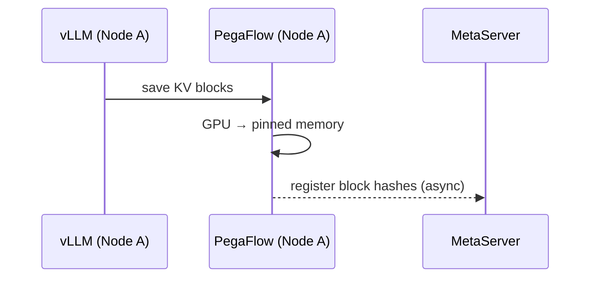
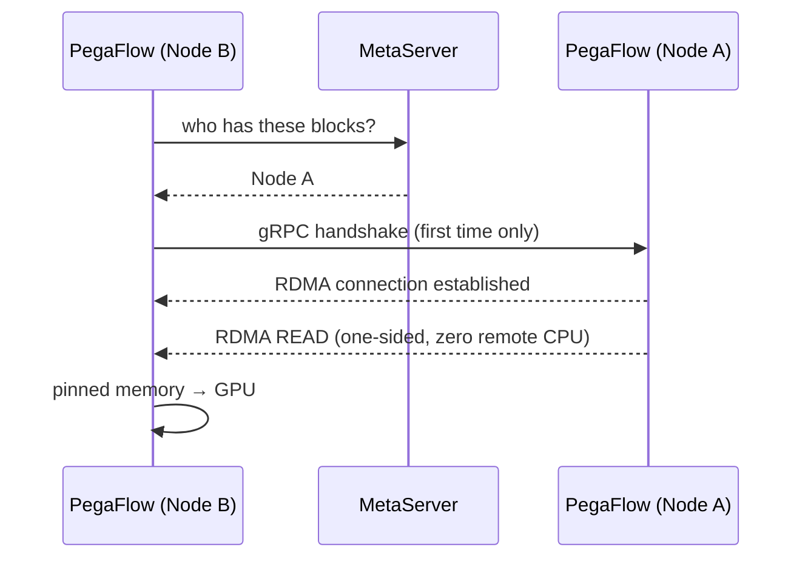

# P2P KV Cache Sharing

Share KV cache across PegaFlow nodes via RDMA. When node B needs blocks that node A already has, node B reads them directly from A's memory — one-sided RDMA READ, zero CPU involvement on the remote side.

**When to use**: multiple PegaFlow instances serving the same model, shared prefixes are common, and you want to reduce TTFT by avoiding redundant prefill.

## How It Works

### Step 1: Save & Register

Node A saves KV blocks to pinned memory. Block hashes are registered with the MetaServer in the background.


```mermaid
sequenceDiagram
    participant vLLM as vLLM (Node A)
    participant A as PegaFlow (Node A)
    participant M as MetaServer

    vLLM->>A: save KV blocks
    A->>A: GPU → pinned memory
    A-->>M: register block hashes (async)
```

### Step 2: Discover & Fetch

Node B needs the same blocks. It queries the MetaServer, discovers Node A has them, and reads them directly via RDMA.


```mermaid
sequenceDiagram
    participant B as PegaFlow (Node B)
    participant M as MetaServer
    participant A as PegaFlow (Node A)

    B->>M: who has these blocks?
    M-->>B: Node A
    B->>A: gRPC handshake (first time only)
    A-->>B: RDMA connection established
    A-->>B: RDMA READ (one-sided, zero remote CPU)
    B->>B: pinned memory → GPU
```

## Quick Start

### 1. Start MetaServer

One per cluster. Lightweight, in-memory only.

```bash
pegaflow-metaserver --addr 0.0.0.0:50056
```

### 2. Start PegaFlow nodes

Two flags enable P2P (must be set together):

- **`--nics <NAME>...`** — which RDMA NICs to use (e.g. `mlx5_0`, `mlx5_0 mlx5_1`). PegaFlow detects each NIC's NUMA node, PCIe topology, and GPU affinity automatically. All pinned memory is registered on these NICs for RDMA access.

- **`--metaserver-addr <URL>`** — the MetaServer address. Once set, this node registers its block hashes with the MetaServer and fetches remote blocks via RDMA when needed.

When P2P is enabled, `--addr` must be a routable IP (not `0.0.0.0` or `127.0.0.1`) — other nodes connect to this address for gRPC handshake and block queries.

**Node A** (e.g. `10.0.0.1`):

```bash
pegaflow-server \
  --addr 10.0.0.1:50055 \
  --pool-size 30gb \
  --nics mlx5_0 \
  --metaserver-addr http://10.0.0.100:50056
```

**Node B** (e.g. `10.0.0.2`):

```bash
pegaflow-server \
  --addr 10.0.0.2:50055 \
  --pool-size 30gb \
  --nics mlx5_0 \
  --metaserver-addr http://10.0.0.100:50056
```

### 3. Launch inference engine

Same as single-node — PegaFlow server handles host-staged P2P transparently.

```bash
vllm serve Qwen/Qwen3-0.6B \
  --kv-transfer-config '{"kv_connector": "PegaKVConnector", "kv_role": "kv_both", "kv_connector_module_path": "pegaflow.connector"}'
```

To select direct GPU reads, pass the connector option through vLLM's
`kv_connector_extra_config`:

```bash
vllm serve Qwen/Qwen3-0.6B \
  --kv-transfer-config '{
    "kv_connector": "PegaKVConnector",
    "kv_role": "kv_both",
    "kv_connector_module_path": "pegaflow.connector",
    "kv_connector_extra_config": {
      "pegaflow.direct_gpu_rdma": true
    }
  }'
```

When enabled, the scheduler carries the remote fetch plan in the query lease
and the worker issues RDMA READs into vLLM's registered GPU KV allocations.
Omitting the option (or setting it to `false`) keeps the existing path of RDMA
READ into host memory followed by host-to-GPU copy. Direct mode currently
supports dense attention cache group 0 only. A failed direct load is surfaced
to vLLM so the request can recompute; it is not automatically retried through
host staging.

### 4. Verify

Use `--log-level debug` to confirm P2P is working. Look for MetaServer registration, RDMA handshake, and RDMA fetch messages in the logs.

## Failure behavior

Host-staged P2P is opportunistic and can proceed without a remote hit when
discovery or transfer fails. Direct GPU mode has a stricter failure boundary:
the failed load is reported to vLLM and the affected prefix is recomputed.

| Scenario | What happens |
|---|---|
| MetaServer unreachable | Hash registration silently dropped. No remote discovery attempted. |
| Remote node unreachable | gRPC handshake fails, fetch aborted. Request proceeds without remote blocks. |
| RDMA transfer timeout | Connection invalidated, transfer lock force-released. Logged as error. |

For direct GPU mode, the last two cases fail the direct load and do not invoke
the host-staging path.

## Direct GPU performance notes

Direct GPU mode removes the requester-side host-to-GPU copy. It does not remove
the other work on the critical path: MetaServer query, the per-segment gRPC
block-metadata query, connection setup on a cold peer, descriptor construction,
RDMA completion waits, transfer-lock release, and the CUDA GPUDirect visibility
flush. The current implementation processes segments in order and flushes the
CUDA context after each segment, so short prefixes or many owner segments can
be latency-bound even when the raw GB300 GPU RDMA bandwidth is higher than the
host-staging path.

The existing 2P2D replay is not an apples-to-apples direct-load benchmark when
NIXL is configured as the P-to-D transfer connector. NIXL performs the main
P-to-D GPU transfer, while PegaFlow only handles the P-side cache lookup/load
for the requests that hit a remote PegaFlow owner. The decode-side
`save_only` connector records no PegaFlow loads. A small end-to-end difference
in that replay therefore does not measure the direct-vs-host-staging copy in
isolation.

The GB300 replay illustrates the dilution. In one paired 8,422-request run,
direct mode completed 1,387 direct loads in 16.322 seconds in aggregate
(about 11.8 ms per direct load), while the host-staging control completed 735
host RDMA fetches in 9.607 seconds (about 13.1 ms per fetch) and had one fetch
error. The direct and host counters cover different cache histories and
different operation boundaries, so these averages are directional evidence,
not a throughput ratio. Overall mean TTFT was 187.527 ms versus 187.460 ms and
throughput was 5.322 versus 5.326 requests/s. The run therefore shows why a
faster direct data path can produce little end-to-end movement: most requests
are misses, and the remaining hit latency includes scheduler work, P-side
prefill, NIXL P-to-D transfer, and decode startup.

To compare the two PegaFlow paths, use the same model, block count, request
ordering, remote owner, and hit set. Make PegaKVConnector the requester-side
`read_write` connector and run the same requests once with direct mode and
once with host staging. For direct mode, use
`pegaflow_direct_gpu_load_total` and
`pegaflow_direct_gpu_load_duration_seconds`; for host staging, use the
`pegaflow_rdma_fetch_*` metrics. The latter do not include direct GPU loads,
and the current direct path does not export a direct-RDMA byte counter, so do
not combine those counters into one bandwidth number. Split the measurement
with connector timings and debug logs into query, metadata/handshake, RDMA
transfer, visibility flush, and vLLM scheduling time.

The current direct implementation has four likely latency costs after the
query: one metadata RPC per owner segment, sequential segment processing,
descriptor construction and completion waits, and creating/binding a CUDA
context plus a GPUDirect visibility flush after each segment. Connection reuse
removes the handshake from warm peers, and local RAM H2D and remote GPU RDMA
already run concurrently. The first optimization candidates are therefore
coalescing or parallelizing owner segments and moving the visibility flush to
the end of a load when the CUDA/RDMA contract permits it; measure each change
with the isolated A/B workload above before changing the data path.

## Tuning

### Hugepages

For pools >64 GB, hugepages significantly reduce RDMA memory registration overhead and transfer latency. Configure before starting PegaFlow:

```bash
# Allocate hugepages (example: 64 GB of 2MB pages)
echo 32768 > /proc/sys/vm/nr_hugepages

pegaflow-server --pool-size 64gb --use-hugepages --nics mlx5_0 ...
```

### NUMA affinity

PegaFlow automatically detects GPU–NIC NUMA affinity at startup. For best performance, ensure GPUs and RDMA NICs share the same NUMA node. Check the topology log at startup.

### MetaServer sizing

| Cluster size | Recommendation |
|---|---|
| 2–8 nodes | Defaults are fine (`120 min` TTL) |
| 8+ nodes | Memory scales with unique blocks across all nodes; no capacity cap needed. Monitor MetaServer memory. |

### Metrics

P2P-related Prometheus metrics (on `:9091/metrics` by default):

| Metric | Type | Description |
|---|---|---|
| `pegaflow_rdma_fetch_total` | Counter | Total per-segment RDMA fetch operations |
| `pegaflow_rdma_fetch_duration` | Histogram | RDMA fetch latency distribution |
| `pegaflow_rdma_fetch_bytes` | Counter | Total bytes fetched via RDMA |
| `pegaflow_rdma_fetch_plan_segments` | Histogram | Planned segment count per executed RDMA fetch plan |
| `pegaflow_rdma_fetch_plan_completed_segments` | Histogram | Completed segment count before a plan stops |
| `pegaflow_direct_gpu_load_total` | Counter | Direct GPU load attempts, labelled by success or error |
| `pegaflow_direct_gpu_load_duration_seconds` | Histogram | End-to-end direct GPU load duration |
| `pegaflow_direct_gpu_mr_registration_failures` | Counter | GPU memory registration failures that prevent direct loads |
| `pegaflow_rdma_qps` | Gauge | Active RDMA queue pairs |
| `pegaflow_transfer_lock_active` | UpDownCounter | Currently held transfer locks |
| `pegaflow_transfer_lock_timeouts_total` | Counter | Transfer lock timeout events |
| `pegaflow_prefetch_stale_gc_total` | Counter | Stale prefetch active entries removed by background GC |

## Troubleshooting

**Blocks not discovered on remote nodes**

- Both nodes must point to the same MetaServer and serve the same model. Namespace is derived from model name and TP config — mismatched models or TP sizes will result in different namespaces.
- Check MetaServer logs for `InsertBlockHashes` — if absent, the source node isn't registering.

**High RDMA fetch latency**

- Check NUMA affinity in the startup topology log — cross-NUMA transfers add latency.
- Enable hugepages for large pools (`--use-hugepages`).

For all P2P issues, `--log-level debug` shows the full handshake and fetch flow.
The direct load duration includes the remote query, RDMA completion, GPU
visibility flush, and any concurrent local H2D load. It is not a raw GPU-RDMA
bandwidth measurement.
