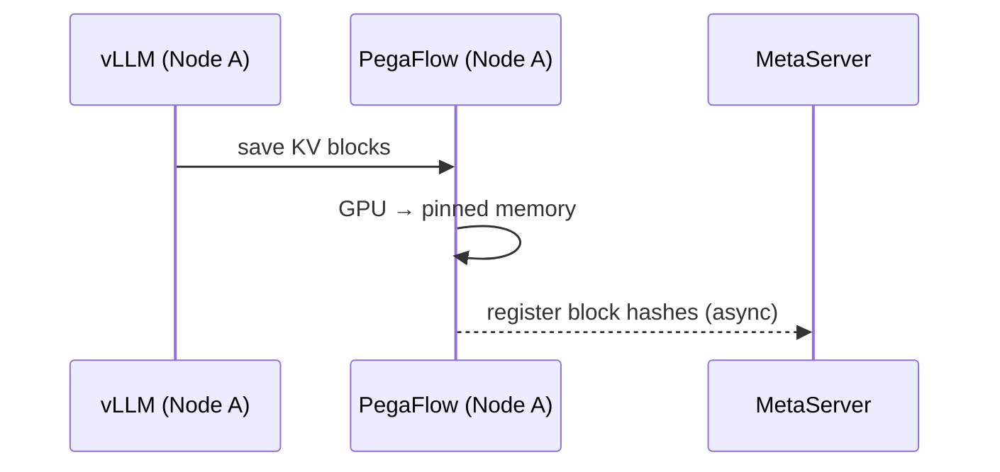
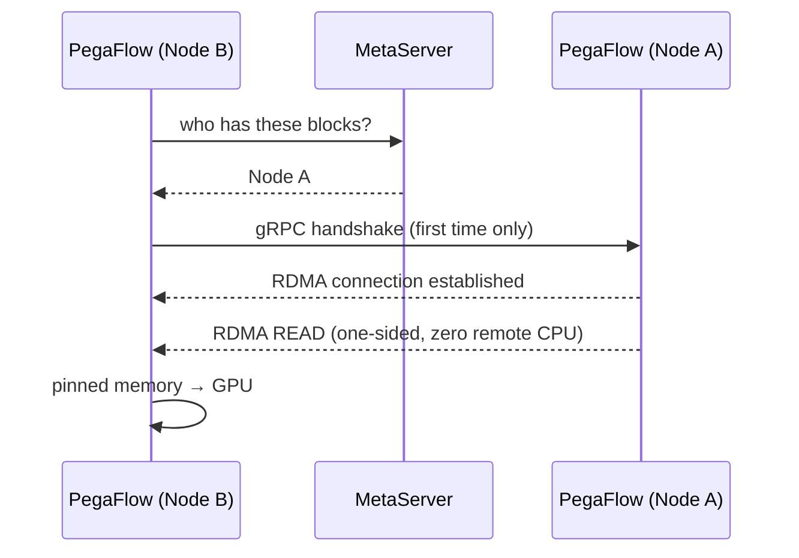
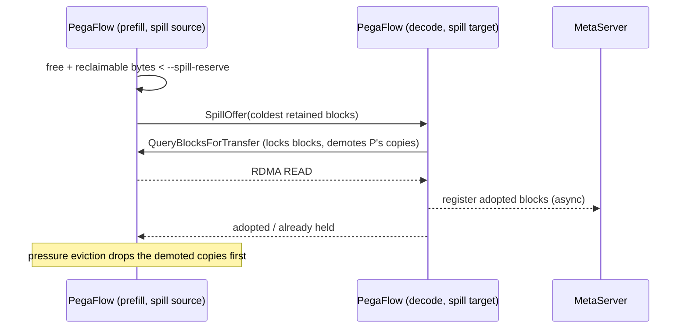

# P2P KV Cache Sharing

Share KV cache across PegaFlow nodes via RDMA. When node B needs blocks that node A already has, node B reads them directly from A's memory — one-sided RDMA READ, zero CPU involvement on the remote side.

**When to use**: multiple PegaFlow instances serving the same model, shared prefixes are common, and you want to reduce TTFT by avoiding redundant prefill.

## How It Works

### Step 1: Save & Register

Node A saves KV blocks to pinned memory. Block hashes are registered with the MetaServer in the background.


```mermaid
sequenceDiagram
    participant vLLM as vLLM (Node A)
    participant A as PegaFlow (Node A)
    participant M as MetaServer

    vLLM->>A: save KV blocks
    A->>A: GPU → pinned memory
    A-->>M: register block hashes (async)
```

### Step 2: Discover & Fetch

Node B needs the same blocks. It queries the MetaServer, discovers Node A has them, and reads them directly via RDMA.


```mermaid
sequenceDiagram
    participant B as PegaFlow (Node B)
    participant M as MetaServer
    participant A as PegaFlow (Node A)

    B->>M: who has these blocks?
    M-->>B: Node A
    B->>A: gRPC handshake (first time only)
    A-->>B: RDMA connection established
    A-->>B: RDMA READ (one-sided, zero remote CPU)
    B->>B: pinned memory → GPU
```

## Quick Start

### 1. Start MetaServer

One per cluster. Lightweight, in-memory only.

```bash
pegaflow-metaserver --addr 0.0.0.0:50056
```

### 2. Start PegaFlow nodes

Two flags enable P2P (must be set together):

- **`--nics <NAME>...`** — which RDMA NICs to use (e.g. `mlx5_0`, `mlx5_0 mlx5_1`). PegaFlow detects each NIC's NUMA node, PCIe topology, and GPU affinity automatically. All pinned memory is registered on these NICs for RDMA access.

- **`--metaserver-addr <URL>`** — the MetaServer address. Once set, this node registers its block hashes with the MetaServer and fetches remote blocks via RDMA when needed.

When P2P is enabled, `--addr` must be a routable IP (not `0.0.0.0` or `127.0.0.1`) — other nodes connect to this address for gRPC handshake and block queries.

**Node A** (e.g. `10.0.0.1`):

```bash
pegaflow-server \
  --addr 10.0.0.1:50055 \
  --pool-size 30gb \
  --nics mlx5_0 \
  --metaserver-addr http://10.0.0.100:50056
```

**Node B** (e.g. `10.0.0.2`):

```bash
pegaflow-server \
  --addr 10.0.0.2:50055 \
  --pool-size 30gb \
  --nics mlx5_0 \
  --metaserver-addr http://10.0.0.100:50056
```

### 3. Launch inference engine

Same as single-node — PegaFlow server handles P2P transparently.

```bash
vllm serve Qwen/Qwen3-0.6B \
  --kv-transfer-config '{"kv_connector": "PegaKVConnector", "kv_role": "kv_both", "kv_connector_module_path": "pegaflow.connector"}'
```

### 4. Verify

Use `--log-level debug` to confirm P2P is working. Look for MetaServer registration, RDMA handshake, and RDMA fetch messages in the logs.

## Spill Tier

P2P only shares blocks between nodes that save them. In a P/D deployment the decode nodes' PegaFlow pools stay empty, because decode instances do not save. The spill tier puts that memory to work: a prefill node hands its coldest blocks to a decode node's PegaFlow before evicting them, and every prefill node can recall them later through the normal P2P path.


```mermaid
sequenceDiagram
    participant P as PegaFlow (prefill, spill source)
    participant D as PegaFlow (decode, spill target)
    participant M as MetaServer

    P->>P: free + reclaimable bytes < --spill-reserve
    P->>D: SpillOffer(coldest retained blocks)
    D->>P: QueryBlocksForTransfer (locks blocks, demotes P's copies)
    P-->>D: RDMA READ
    D-->>M: register adopted blocks (async)
    D-->>P: adopted / already held
    Note over P: pressure eviction drops the demoted copies first
```

The decode node keeps the blocks *retained* (it now holds the copy that must be kept), while the prefill node's copies become *reclaimable*: they keep serving local hits until pressure evicts them, and eviction always drops reclaimable blocks before retained ones. When any prefill node later misses a spilled block, the MetaServer points it at the decode node and the block is fetched over RDMA like any other P2P hit; the decode copy then becomes reclaimable. Eviction never waits on a spill — if the spill source falls behind, eviction drops retained blocks exactly as without the spill tier.

Both sides need P2P enabled (`--nics` and `--metaserver-addr`).

Spill targets are meant for decode nodes whose PegaFlow pool vLLM does not write to: run their vLLM with NIXL only, not with the PegaFlow connector in `save_only` mode (see [Deployment](./deployment.md#pd-with-nixl)).

**Prefill node** (spill source):

```bash
pegaflow-server \
  --addr 10.0.0.1:50055 \
  --pool-size 30gb \
  --nics mlx5_0 \
  --metaserver-addr http://10.0.0.100:50056 \
  --spill-targets 10.0.0.11:50055   # or: --spill-targets auto
```

**Decode node** (spill target):

```bash
pegaflow-server \
  --addr 10.0.0.11:50055 \
  --pool-size 200gb \
  --nics mlx5_0 \
  --metaserver-addr http://10.0.0.100:50056 \
  --spill-accept
```

- `--spill-targets` lists decode-node addresses; offers go to the first reachable one and later entries are failover. Pairing each prefill node with one decode node keeps a request's blocks on one node, so recalls stay single-segment.
- `--spill-targets auto` lets the MetaServer do the pairing instead: every `--spill-accept` node announces its pool size on its heartbeat, and each prefill node is assigned one target (plus failover candidates), balanced by assigned prefill nodes per byte of target capacity. Assignments are sticky; a prefill node moves only when a target leaves, stops heartbeating, or a new target would strictly improve the balance. Changing the P:D ratio therefore needs no prefill-node restart — changes take effect within one heartbeat period (half the MetaServer's node stale timeout).
- `--spill-reserve` (default `5%` of the pool) is how much of the pool the source keeps free or reclaimable. With NUMA-aware pools each node's pool owes its capacity share, so an idle node's free memory does not hide a full one. Size it to cover save bursts and well above one eviction pass (512 blocks), and run spill sources with `--blockwise-alloc`: with the default batch allocation, blocks saved together share pinned memory, so evicting a spilled block frees memory only once its batch-mates are evicted too; `pegaflow_cache_block_evictions_by_class{class="retained"}` counts the blocks evicted before they could be spilled.
- `--spill-max-inflight` (default `512mb`) bounds the bytes a decode node pulls at once. Without `--spill-max-bandwidth` there is no rate limit.
- `--spill-max-bandwidth` (optional) caps the bytes per second a decode node pulls. Spill pulls travel the same direction as the P/D KV handoff (prefill → decode); on a NIC the handoff saturates, a cap keeps headroom for it. The cap is a token bucket with one second of burst; offers over budget are rejected and retried by the source, and the budget is not lost meanwhile. The spill tier can only cover evictions up to this rate: when a prefill node evicts faster (its new-KV save rate once the pool is full), the excess is evicted unspilled, exactly as without the spill tier.

## Fallback Behavior

P2P is opportunistic. Failures degrade gracefully to single-node operation — no crashes, no significant performance impact in most cases.

| Scenario | What happens |
|---|---|
| MetaServer unreachable | Hash registration silently dropped. No remote discovery attempted. |
| Remote node unreachable | gRPC handshake fails, fetch aborted. Request proceeds without remote blocks. |
| RDMA transfer timeout | Connection invalidated, transfer lock force-released. Logged as error. |
| Spill target unreachable or over budget | The source backs off (per target, up to 10 s) and fails over to the next `--spill-targets` entry. Blocks it could not hand off stay retained and are evicted as without the spill tier. |

## Tuning

### Hugepages

For pools >64 GB, hugepages significantly reduce RDMA memory registration overhead and transfer latency. Configure before starting PegaFlow:

```bash
# Allocate hugepages (example: 64 GB of 2MB pages)
echo 32768 > /proc/sys/vm/nr_hugepages

pegaflow-server --pool-size 64gb --use-hugepages --nics mlx5_0 ...
```

### NUMA affinity

PegaFlow automatically detects GPU–NIC NUMA affinity at startup. For best performance, ensure GPUs and RDMA NICs share the same NUMA node. Check the topology log at startup.

### MetaServer sizing

| Cluster size | Recommendation |
|---|---|
| 2–8 nodes | Defaults are fine (`120 min` TTL) |
| 8+ nodes | Memory scales with unique blocks across all nodes; no capacity cap needed. Monitor MetaServer memory. |

### Metrics

P2P-related Prometheus metrics (on `:9091/metrics` by default):

| Metric | Type | Description |
|---|---|---|
| `pegaflow_rdma_fetch_total` | Counter | Total per-segment RDMA fetch operations |
| `pegaflow_rdma_fetch_duration` | Histogram | RDMA fetch latency distribution |
| `pegaflow_rdma_fetch_bytes` | Counter | Total bytes fetched via RDMA |
| `pegaflow_rdma_fetch_plan_segments` | Histogram | Planned segment count per executed RDMA fetch plan |
| `pegaflow_rdma_fetch_plan_completed_segments` | Histogram | Completed segment count before a plan stops |
| `pegaflow_rdma_qps` | Gauge | Active RDMA queue pairs |
| `pegaflow_transfer_lock_active` | UpDownCounter | Currently held transfer locks |
| `pegaflow_transfer_lock_timeouts_total` | Counter | Transfer lock timeout events |
| `pegaflow_prefetch_stale_gc_total` | Counter | Stale prefetch active entries removed by background GC |
| `pegaflow_spill_offers_total` | Counter | Spill offers sent by a spill source (`result=accepted\|rejected\|error`) |
| `pegaflow_spill_blocks_total` | Counter | Offered blocks by outcome (`outcome=adopted\|already_held\|unclaimed`) |
| `pegaflow_spill_adoptions_total` | Counter | Spill offers handled by a spill target (`result=accepted\|throttled\|disabled`) |
| `pegaflow_spill_adopted_bytes_total` | Counter | Bytes a spill target pulled and retained |

## Troubleshooting

**Blocks not discovered on remote nodes**

- Both nodes must point to the same MetaServer and serve the same model. Namespace is derived from model name and TP config — mismatched models or TP sizes will result in different namespaces.
- Check MetaServer logs for `InsertBlockHashes` — if absent, the source node isn't registering.

**High RDMA fetch latency**

- Check NUMA affinity in the startup topology log — cross-NUMA transfers add latency.
- Enable hugepages for large pools (`--use-hugepages`).

For all P2P issues, `--log-level debug` shows the full handshake and fetch flow.
