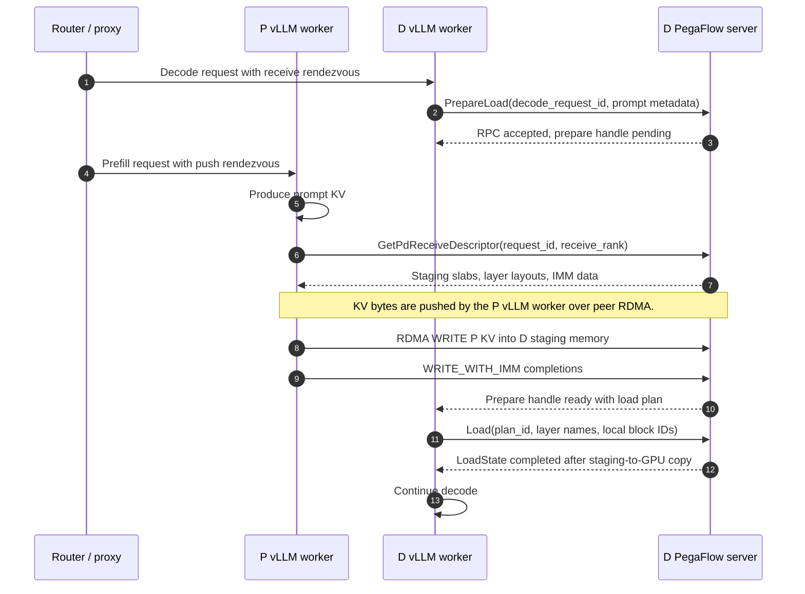

# PegaFlow P/D Disaggregation Design

## 1. Overview

PegaFlow P/D disaggregation separates prompt prefill (P) and token decode (D)
onto different inference workers while preserving KV cache reuse across that
boundary. P computes prompt KV once, PegaFlow transfers the reusable KV to D,
and D resumes decode without recomputing the prompt.

The design is push-based: D prepares a receive target, P pushes KV to that
target, and D makes the received KV visible to the decode worker. D can choose
between CPU staging and direct GPU receive based on KV cache pressure and
time-to-first-token (TTFT) requirements. CPU staging avoids committing scarce
GPU KV cache blocks before transfer readiness is known; direct GPU receive
avoids the extra CPU-to-GPU copy when D has enough GPU KV cache headroom.

CPU staging is the implemented receive path today. Direct GPU receive is part
of the design goal, but still requires vLLM GPU allocation ownership, memory
registration, and RDMA-to-GPU completion ordering work.

This document is the final P/D design document. Older exploratory notes should
be folded into this file or removed once their useful details are represented
here.

## 2. Goals And Non-Goals

### Goals

- **Unify KV cache and P/D transfer.** P/D should reuse PegaFlow's KV cache
  metadata, lifecycle, and load path instead of becoming a separate transfer
  subsystem that cannot interoperate with normal KV reuse.
- **Keep router integration flexible.** P/D should require only a small,
  stable router contract so different routers can integrate without depending
  on PegaFlow's internal KV layout or transfer implementation.
- **Optimize transfer across topologies.** PegaFlow should choose the fastest
  practical transfer path for the sender and receiver topology, including
  CPU staging, direct GPU receive, and tensor-parallel layout differences where
  supported.
- **Provide high availability.** Timeout, cancellation, partial transfer, node
  failure, and retry should be handled without leaking resources or leaving
  requests in ambiguous states.

### Non-Goals

- **Router policy.** This design defines the P/D integration contract, but not
  how a router chooses P/D pairs, balances load, or enforces scheduling policy.

## 3. Architecture

P/D is split across the router, the P and D inference workers, and the local
PegaFlow engine attached to each worker. The router coordinates request flow.

The sequence below shows the implemented CPU-staging path. Direct GPU receive
is not shown here.



### Components

- **Router.** Coordinates request flow by selecting P and D workers, assigning a
  shared P/D request identity, and injecting rendezvous metadata that lets the P
  worker reach the selected D-side PegaFlow instance. It sends a short
  non-streaming prefill request to P while forwarding the original decode request
  to D.
- **P worker.** Runs prefill and, once prompt KV is produced, uses the PegaFlow
  connector inside the vLLM worker process to push that KV to the selected
  D-side rendezvous target. The connector fetches the D receive descriptor,
  writes KV into D staging memory, and sends the IMM readiness signal.
- **D worker.** Runs decode and uses the PegaFlow connector to prepare the
  receive side for the selected P/D request. It waits until P has pushed the
  prompt KV, loads the staged KV into its local GPU KV cache, and then continues
  decode.
- **PegaFlow engine.** Maintains instance topology, registered KV layouts,
  receive leases, staging-slab descriptors, IMM readiness, and prepared load
  plans. On D, `PrepareLoad` with a `decode_request_id` creates the CPU staging
  receive lease, accepts the RPC immediately, and later updates the prepare
  handle with the same prepared load plan consumed by the normal `Load` RPC.
- **Transfer engine.** Provides the peer RDMA path used by the P worker process
  to write registered P-side KV cache memory into the D-side staging slabs
  described by PegaFlow, then sends WRITE-with-IMM completions. P/D push bytes
  flow from the P-side vLLM worker process to D-side staging memory; the
  PegaFlow server owns the descriptor, staging-lease, readiness, and load-plan
  control path.

### P/D Push Flow

P/D push starts as a normal OpenAI-compatible request at the router and then
splits into a D-side receive path and a P-side push path:

**Router selects the P/D pair.** It handles `/v1/completions` and
`/v1/chat/completions`, chooses one P endpoint and one D endpoint, and uses the
incoming `request_id` if present or generates a new one. The shared id is
written back into both request bodies as `request_id` and also sent as the
`X-Request-Id` header.

With P/D push enabled, the router injects request-scoped metadata into
`kv_transfer_params`. The P request is marked as the source and includes the
selected D PegaFlow endpoint; the D request is marked as the target and includes
the selected D instance id:

```json
{
  "kv_transfer_params": {
    "pegaflow_pd": {
      "enabled": true,
      "mode": "cpu_staging_push",
      "role": "source",
      "pd_request_id": "<shared request id>",
      "dst_instance_id": "<selected D instance id>",
      "d_pegaflow_addr": "<selected D PegaFlow endpoint>"
    }
  }
}
```

```json
{
  "kv_transfer_params": {
    "pegaflow_pd": {
      "enabled": true,
      "mode": "cpu_staging_push",
      "role": "target",
      "pd_request_id": "<shared request id>",
      "dst_instance_id": "<selected D instance id>"
    }
  }
}
```

The router rewrites the P request so it only drives prefill: it sets
`stream=false`, removes `stream_options`, sets `max_tokens=1`, clamps an
existing `min_tokens` to `1`, and sets `min_tokens=0` when it is absent. The P
request is sent in a background task; its response is logged but not returned to
the client.

The D request keeps the client-facing generation settings. The router restores
the original `max_tokens`, `stream`, and `stream_options`, injects the target
metadata, and forwards the request to D. For non-streaming calls, the router
returns D's HTTP status and JSON body. For streaming calls, it forwards D's byte
stream as `text/event-stream`; the P request remains a background prefill/push
operation while the client receives D's stream.

**D prepares the receive side.** The D connector calls `PrepareLoad` on its
local PegaFlow server with the vLLM request id, the shared P/D request id as
`decode_request_id`, prompt token counts, computed-token count, virtual block
size, and the available block hashes. In the CPU-staging path, the server uses
the D instance registration to determine receive ranks and layer layout, creates
a request-scoped receive lease keyed by the D instance id and P/D request id,
allocates one staging slab per receive rank from the D-side pinned pool, assigns
a lease handle and IMM value, accepts the RPC, and updates the connector's
shared-memory prepare handle later when staged KV is ready.

**P computes and pushes prompt KV.** After prefill produces prompt KV, the P
connector asks the selected D PegaFlow server for the write target with
`GetPdReceiveDescriptor(dst_instance_id, pd_request_id, receive_rank)`. The
current implementation uses the P worker's local effective TP rank as the D
receive rank, so homogeneous P/D layouts map rank `r` on P to receive rank `r`
on D. If D has not prepared the lease yet, the descriptor lookup stays pending
and P polls. Once the lease is prepared, the descriptor includes the lease
handle, staging slab base pointer and size, rank metadata, per-layer offsets and
strides, staged block count, block hashes, expiry time, and IMM value. At this
point the descriptor is usable as a write target; the staged KV data itself is
still pending.

**KV bytes move peer-to-peer.** The P vLLM worker process writes its registered
KV cache memory directly into D staging memory through the transfer engine. For
each layer in the descriptor, the connector matches the local registered layer,
maps local block IDs to local KV cache addresses, maps staged block indexes to
remote slab addresses using the descriptor's layer offsets and strides, and
submits RDMA WRITE descriptors. After the data writes complete, P sends the
expected WRITE-with-IMM completions using the descriptor's IMM value as the
readiness signal.

**D turns readiness into a load plan.** The D PegaFlow server observes IMM
completions, increments the receive lease's observed write count, and marks the
lease ready when the expected count has arrived. The prepare loop then checks
out the ready lease, converts the staging slabs and layer layouts into a
prepared load plan, and writes the external token count and plan id into the D
connector's prepare handle.

**D loads and continues decode.** vLLM allocates local GPU KV cache blocks for
the external tokens. The D worker calls `Load` with the prepared plan and local
block IDs; PegaFlow copies the staged KV into those GPU blocks and D continues
decode.

The router-facing contract stays request-scoped: request identity, role
metadata, and the selected D rendezvous target. Block hashes, layer layout,
staging addresses, and load plans are produced by the vLLM connector and the
local PegaFlow servers after the request reaches the selected workers.

### Receive Targets

D owns receive-target selection because only D has local visibility into GPU KV
cache pressure, allocation timing, and TTFT tradeoffs. CPU staging allows D to
receive KV before committing GPU KV cache blocks. Direct GPU receive avoids the
extra CPU-to-GPU copy when D can allocate GPU destination blocks early.
